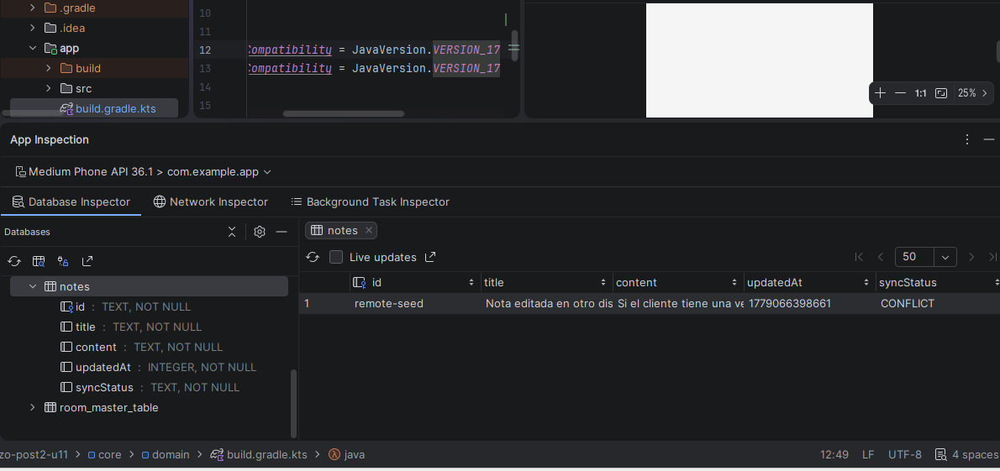
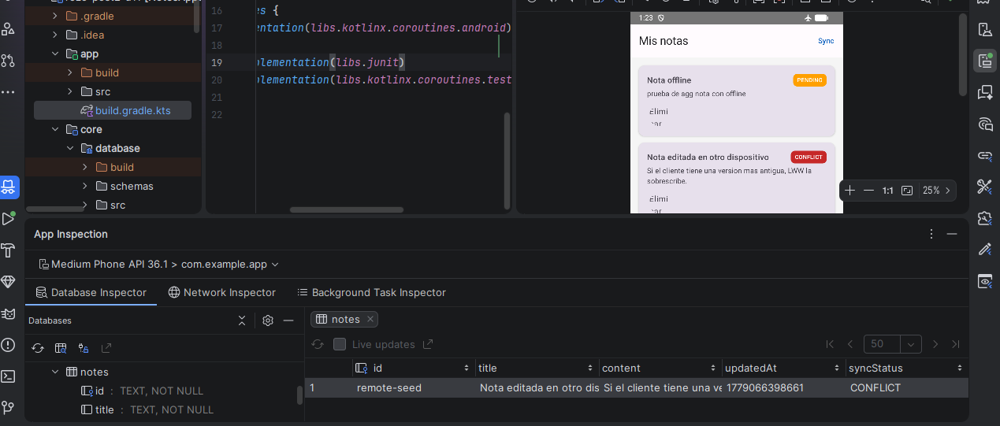
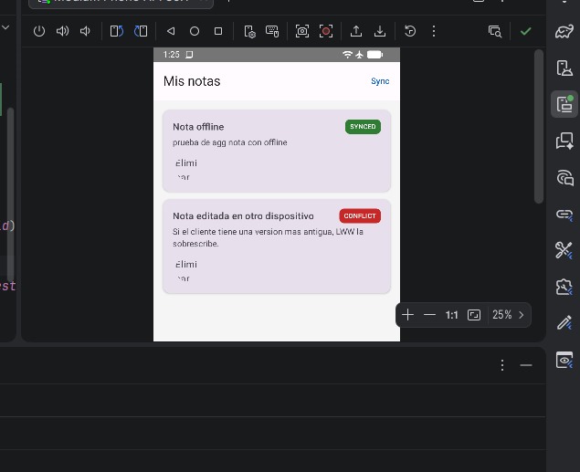
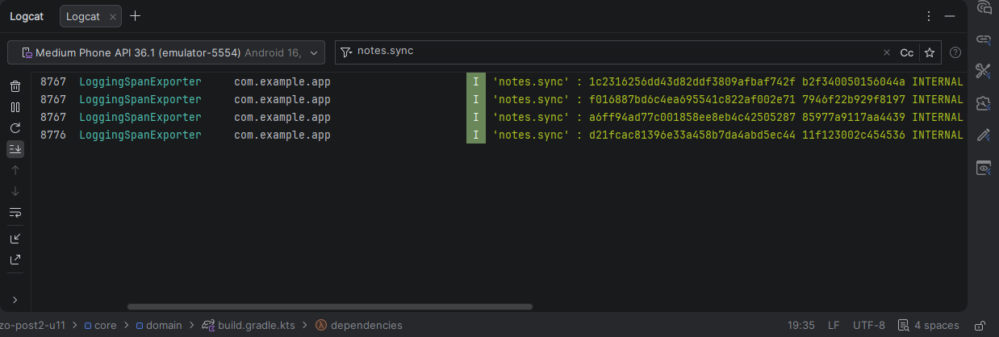

# Sincronización Offline-First y Observabilidad con OpenTelemetry en Android

## Autor

**Nombre:** Jhoseth Esneider Rozo Carrillo  
**Código:** 02230131027  
**Programa:** Ingeniería de Sistemas  
**Unidad:** Unidad 11 – Integración Avanzada y Patrones Arquitectónicos  
**Actividad:** Post-Contenido 2  
**Fecha:** 2026

---

# Descripción del Proyecto

Este proyecto implementa una estrategia completa de sincronización offline-first en Android utilizando Room, WorkManager y Flows, permitiendo que la aplicación continúe funcionando incluso sin conexión a internet.

Además, se integra OpenTelemetry para instrumentar y observar el proceso de sincronización mediante spans y trazas registradas en Logcat.

La aplicación aplica una política de resolución de conflictos basada en Last-Write-Wins (LWW), donde siempre prevalece la versión más reciente de los datos según el timestamp `updatedAt`.

---

# Objetivo

Implementar un sistema de sincronización offline-first que permita:

- Crear y editar notas sin conexión
- Persistir datos localmente usando Room
- Sincronizar automáticamente cuando vuelve la conectividad
- Resolver conflictos con estrategia Last-Write-Wins
- Reintentar sincronizaciones fallidas con WorkManager
- Instrumentar el flujo completo con OpenTelemetry
- Registrar spans y métricas de sincronización en Logcat

---

# Dependencias Principales

```kotlin
dependencies {

    // Room
    implementation("androidx.room:room-runtime:2.6.1")
    implementation("androidx.room:room-ktx:2.6.1")
    kapt("androidx.room:room-compiler:2.6.1")

    // WorkManager
    implementation("androidx.work:work-runtime-ktx:2.9.0")

    // Coroutines + Flow
    implementation("org.jetbrains.kotlinx:kotlinx-coroutines-android:1.8.0")

    // Hilt
    implementation("com.google.dagger:hilt-android:2.51")
    kapt("com.google.dagger:hilt-compiler:2.51")

    // OpenTelemetry
    implementation("io.opentelemetry.android:opentelemetry-android:0.5.0-alpha")

    // Networking
    implementation("com.squareup.retrofit2:retrofit:2.11.0")
    implementation("com.squareup.okhttp3:logging-interceptor:4.12.0")
}
```

---

# Arquitectura del Proyecto

```text
app/
│
├── core/
│   ├── database/
│   │   ├── dao/
│   │   ├── entity/
│   │   └── AppDatabase.kt
│   │
│   ├── network/
│   │   ├── api/
│   │   └── dto/
│   │
│   └── telemetry/
│       └── OpenTelemetryConfig.kt
│
├── feature/
│   └── notes/
│       ├── data/
│       ├── domain/
│       ├── presentation/
│       └── worker/
│
└── ui/
    └── screens/
```

---

# Estructura de la Base de Datos

La entidad `NoteEntity` incluye los campos necesarios para sincronización y resolución de conflictos.

```kotlin
@Entity(tableName = "notes")
data class NoteEntity(

    @PrimaryKey
    val id: String,

    val title: String,

    val content: String,

    val updatedAt: Long = System.currentTimeMillis(),

    val syncStatus: SyncStatus = SyncStatus.PENDING
)
```

---

# Estados de Sincronización

```kotlin
enum class SyncStatus {
    PENDING,
    SYNCED,
    CONFLICT
}
```

### Descripción

- `PENDING` → pendiente de sincronizar
- `SYNCED` → sincronizado correctamente
- `CONFLICT` → existe conflicto de versiones

---

# DAO de Room

```kotlin
@Dao
interface NoteDao {

    @Query("SELECT * FROM notes ORDER BY updatedAt DESC")
    fun observeAll(): Flow<List<NoteEntity>>

    @Query("SELECT * FROM notes WHERE syncStatus = 'PENDING'")
    suspend fun getPending(): List<NoteEntity>

    @Upsert
    suspend fun upsert(note: NoteEntity)

    @Query("UPDATE notes SET syncStatus = 'SYNCED' WHERE id = :id")
    suspend fun markSynced(id: String)
}
```

---

# SyncWorker con WorkManager

El `SyncWorker` se encarga de enviar al servidor todas las notas pendientes cuando existe conectividad.

```kotlin
@HiltWorker
class SyncWorker @AssistedInject constructor(

    @Assisted ctx: Context,
    @Assisted params: WorkerParameters,
    private val noteDao: NoteDao,
    private val noteApiService: NoteApiService

) : CoroutineWorker(ctx, params) {

    override suspend fun doWork(): Result {

        return try {

            val pending = noteDao.getPending()

            pending.forEach { note ->

                noteApiService.upsertNote(note.toDto())
                noteDao.markSynced(note.id)
            }

            Result.success()

        } catch (e: IOException) {

            if (runAttemptCount < 3) {
                Result.retry()
            } else {
                Result.failure()
            }
        }
    }
}
```

---

# Estrategia Offline-First

La aplicación funciona primero sobre la base de datos local.

## Flujo

1. Usuario crea una nota sin internet
2. Room almacena la información localmente
3. `syncStatus` queda en `PENDING`
4. WorkManager detecta conectividad
5. SyncWorker sincroniza con el servidor
6. La nota pasa a estado `SYNCED`

---

# Programación Automática del Worker

```kotlin
fun scheduleSyncOnConnectivity(context: Context) {

    WorkManager.getInstance(context)
        .enqueueUniqueWork(

            "notes-sync",

            ExistingWorkPolicy.KEEP,

            OneTimeWorkRequestBuilder<SyncWorker>()
                .setConstraints(
                    Constraints(
                        requiredNetworkType = NetworkType.CONNECTED
                    )
                )
                .setBackoffCriteria(
                    BackoffPolicy.EXPONENTIAL,
                    15,
                    TimeUnit.SECONDS
                )
                .build()
        )
}
```

---

# Resolución de Conflictos Last-Write-Wins

La aplicación compara los timestamps `updatedAt`.

La versión más reciente siempre reemplaza a la más antigua.

```kotlin
if (local == null || serverNote.updatedAt > local.updatedAt) {

    noteDao.upsert(
        serverNote.toEntity().copy(
            syncStatus = SyncStatus.SYNCED
        )
    )
}
```

---

# OpenTelemetry y Observabilidad

Se instrumenta el flujo de sincronización usando spans.

```kotlin
val span = tracer.spanBuilder("notes.sync")
    .setAttribute("sync.attempt", runAttemptCount.toLong())
    .startSpan()
```

---

# Información Registrada en los Spans

Cada sincronización registra:

- Número de intento
- Cantidad de notas pendientes
- Tiempo de ejecución
- Errores capturados
- Resultado de sincronización

---

# InstrumentedSyncWorker

```kotlin
class InstrumentedSyncWorker(...) : CoroutineWorker(ctx, params) {

    private val tracer =
        GlobalOpenTelemetry.getTracer("com.example.app.sync")

    override suspend fun doWork(): Result {

        val span = tracer.spanBuilder("notes.sync")
            .setAttribute("sync.attempt", runAttemptCount.toLong())
            .startSpan()

        return withContext(Dispatchers.IO + span.asContextElement()) {

            try {

                val pending = noteDao.getPending()

                span.setAttribute(
                    "sync.pending_count",
                    pending.size.toLong()
                )

                pending.forEach { note ->

                    noteApiService.upsertNote(note.toDto())
                    noteDao.markSynced(note.id)
                }

                span.setStatus(StatusCode.OK)

                Result.success()

            } catch (e: Exception) {

                span.recordException(e)

                span.setStatus(
                    StatusCode.ERROR,
                    e.message ?: "sync failed"
                )

                if (runAttemptCount < 3) {
                    Result.retry()
                } else {
                    Result.failure()
                }

            } finally {

                span.end()
            }
        }
    }
}
```

---

# Decisiones de Diseño

## 1. Arquitectura Offline-First

La aplicación nunca depende completamente del servidor para funcionar.

Beneficios:

- Mejor experiencia de usuario
- Uso sin internet
- Menor pérdida de datos

---

## 2. Uso de WorkManager

Se eligió WorkManager porque:

- Sobrevive reinicios del dispositivo
- Soporta restricciones de red
- Implementa retries automáticos
- Permite backoff exponencial

---

## 3. Resolución Last-Write-Wins

LWW simplifica el manejo de conflictos distribuidos.

Ventajas:

- Fácil de implementar
- Evita inconsistencias
- Adecuado para aplicaciones móviles simples

---

## 4. OpenTelemetry

Se usa OpenTelemetry para:

- Monitorear sincronizaciones
- Detectar errores
- Medir tiempos
- Analizar comportamiento offline-first

---

# Ejecución del Proyecto

## 1. Clonar el repositorio

```bash
git clone https://github.com/jerc31/rozo-post2_u11
```

---

## 2. Abrir en Android Studio

Abrir el proyecto y sincronizar Gradle.

---

## 3. Ejecutar la aplicación

Usar:

- Emulador Android API 30+
- O dispositivo físico

---

## 4. Probar flujo offline-first

### Escenario

1. Activar modo avión
2. Crear una nota
3. Verificar estado `PENDING`
4. Activar internet
5. Esperar ejecución del Worker
6. Verificar estado `SYNCED`

---

# Checkpoints del Laboratorio

# Checkpoint 1 — Migración Room

✔ La base de datos se crea correctamente  
✔ El campo `syncStatus` existe  
✔ La aplicación inicia sin errores

---

# Checkpoint 2 — SyncWorker

✔ Crear nota sin conexión  
✔ Activar conectividad  
✔ Worker sincroniza automáticamente  
✔ Estado cambia a `SYNCED`

---

# Checkpoint 3 — OpenTelemetry

✔ Los spans aparecen en Logcat  
✔ Se registran atributos:

- `sync.attempt`
- `sync.pending_count`

✔ Se visualizan errores y duración del sync

---

# Flujo Completo de Sincronización

```text
Usuario crea nota
        ↓
Room guarda localmente
        ↓
syncStatus = PENDING
        ↓
WorkManager espera conectividad
        ↓
SyncWorker ejecuta sincronización
        ↓
Servidor recibe datos
        ↓
syncStatus = SYNCED
        ↓
OpenTelemetry registra spans
```

---

## Capturas del Proyecto

Las siguientes capturas se encuentran en la carpeta `/evidencias/`:

## Base de datos con syncStatus



---

## Nota creada sin conexión



---

## Worker sincronizando notas



---

## Spans OpenTelemetry en Logcat


